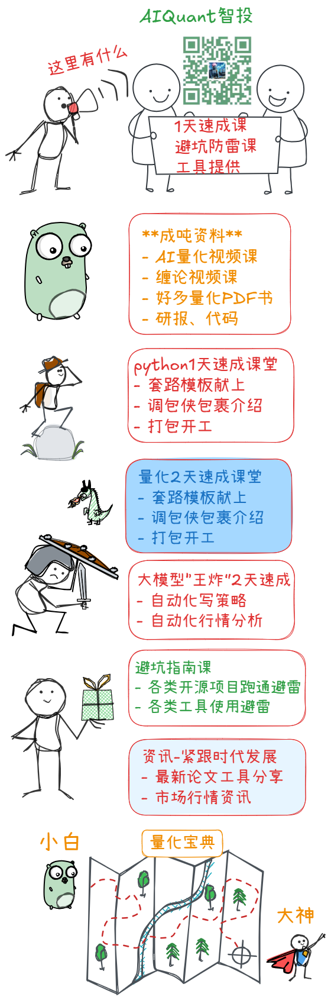

<div align="center">


# 🤖 AI量化交易操盘手

**一站式AI量化交易平台 · 从学习、模拟到实盘**

[**ENGLISH VERSION**](https://github.com/charliedream1/ai_quant_trade/blob/master/README_EN.md)

[](https://opensource.org/licenses/Apache-2.0)
[](https://github.com/charliedream1/ai_quant_trade)
[](https://github.com/charliedream1/ai_quant_trade)

</div>

---

<p align="center">
  <a href="#-新特性">🔥 新特性</a> •
  <a href="#-简介">📖 简介</a> •
  <a href="#-快速开始">🚀 快速开始</a> •
  <a href="#-本地量化策略">📊 量化策略</a> •
  <a href="#-大模型应用">🤖 大模型</a> •
  <a href="#-因子挖掘">⛏️ 因子挖掘</a> •
  <a href="#-数据处理">💾 数据</a> •
  <a href="#-辅助操盘工具">🛠️ 工具</a> •
  <a href="#-配套资源">🎁 资源</a>
</p>

---

## ✨ 核心亮点

| 🎯 定位 | 📌 说明 |
|:---:|:---|
| 🏦 **一站式平台** | 从学习、模拟到实盘，全流程覆盖 |
| 📈 **多元策略** | 大模型、因子挖掘、传统策略、机器学习、深度学习、强化学习、图网络、高频交易 |
| 📚 **资源汇总** | 全网资源汇总、实战案例、论文解读、代码实现 |
| 🛠️ **辅助工具** | 辅助盯盘、股票推荐等实用操盘工具 |
| 🌍 **多市场覆盖** | 覆盖股票、基金、加密货币等多个市场 |
| 🚀 **实盘部署** | 支持 Python/C++/CPU/GPU 等多种部署方式 |

---

## 🔥 新特性

| **时间** | **特性** |
|:---|:---|
| 2025.08.09 | 🆕 [**推理型股价预测大模型训练教程（预测准确率提升20%，且可解析）**](egs_courses/01_推理型股价预测大模型训练教程.md) |
| 2025.05.17 | 🆕 [**Unsloth推理型股价预测大模型（代码见本仓库、详细指南+模型见星球）**](egs_llm/a01_train/a01_unsloth_stock_forcaster) |
| 2025.01.03 | [**大模型金融市场分析（视频教程见星球或公众号）**](egs_llm/b01_app/a01_hot_topic_report/v1_proto_internet) |

<details>
<summary>📂 <b>2023 年更新</b></summary>

| **时间** | **特性** |
|:---|:---|
| 2023.04.09 | [**StructBERT市场情绪分析**](https://github.com/charliedream1/ai_quant_trade/tree/master/egs_fin_nlp/emotion_analysis/01_StructBert_Binary_Class) |
| 2023.03.28 | [**强化学习多股票交易：年化收益53%**](https://github.com/charliedream1/ai_quant_trade/tree/master/egs_trade/rl/a002_finRL_tutorial/a01_Stock_NeurIPS2018) |
| 2023.02.28 | [**机器学习自动挖掘5000个因子及股票趋势预测**](https://github.com/charliedream1/ai_quant_trade/tree/master/egs_alpha/auto_alpha/tsfresh) |
| 2023.02.05 | [**利用EXCEL看盘**](https://github.com/charliedream1/ai_quant_trade/tree/master/egs_aide/%E7%9C%8B%E7%9B%98%E7%A5%9E%E5%99%A8/v1) |
| 2023.01.01 | [**本地深度强化学习策略**](https://github.com/charliedream1/ai_quant_trade/tree/master/egs_trade/rl/a001_proto_sb3) |

</details>

<details>
<summary>📂 <b>2022 年更新</b></summary>

| **时间** | **特性** |
|:---|:---|
| 2022.11.07 | [**Wind本地实盘模拟**](https://github.com/charliedream1/ai_quant_trade/tree/master/egs_trade/real_bid_simulate/wind) |
| 2022.08.03 | [**基础回测框架 + 双均线策略**](https://github.com/charliedream1/ai_quant_trade/tree/master/egs_trade/vanilla/double_ma) |

</details>

---

## 📖 简介

### 适合人群

- 🏢 **机构投资者**
- 👨‍💻 **散户（有编程基础）**
- 🌱 **散户（无编程基础）**

### 项目结构

```
ai_quant_trade
├── ai_notes ........... 金融量化交易知识（Markdown / Jupyter Notebook 知识体系）
│   ├── 资源 ........... 持续收录全网优秀资源
│   ├── 实战 ........... 各类工具、框架、库的使用及踩坑实录
│   └── 热点 ........... 金融市场热点、技术热点、论文解读
├── docs ............... 本仓库使用说明文档
├── egs_aide ........... 辅助操盘工具（看盘神器等）
├── egs_alpha .......... 因子库 & 因子挖掘
├── egs_data ........... 数据获取及处理（Wind / 开源工具）
├── egs_fin_nlp ........ 文本分析（情感分析等）
├── egs_llm ............ 大模型应用（股价预测 / 金融分析）
├── egs_online_platform  在线投研平台策略（优矿 / 聚宽）
├── egs_trade .......... 本地量化炒股策略
│   ├── paper_trade .... 实盘模拟（Wind万得）
│   ├── rl ............. 强化学习炒股
│   ├── ms_qlib ........ 微软Qlib框架
│   └── vanilla ........ 传统规则类策略
├── quant_brain ........ 核心算法库
├── runtime ............ 模型部署和实际使用
├── tools .............. 辅助工具
├── requirements.txt
└── README.md
```

---

## 🚀 快速开始

本仓库暂未封装为 Python 包，请克隆整个项目后，进入各 `egs` 目录查看详细的 **使用说明** 和 **原理介绍**。

```bash
# 1. 克隆仓库
git clone https://github.com/charliedream1/ai_quant_trade.git

# 2. 安装依赖
pip install -r requirements.txt

# 3. 进入对应示例目录，查看 README 开始使用
cd egs_trade/rl/a002_finRL_tutorial/a01_Stock_NeurIPS2018
```

---

## 📊 本地量化策略

> 📁 **代码目录**：[egs_trade](egs_trade)
>
> 🎯 每个实例均配备完善的教程，从原理、使用到代码解读。

可在本地构建一套独立的量化交易系统，涵盖以下策略类型：

| 类别 | 策略 | 状态 |
|:---:|:---|:---:|
| 🤖 AI策略 | 强化学习、图网络、深度学习、机器学习、高频交易、因子挖掘、大模型 | ✅ / 🔨 |
| 📐 传统策略 | 规则类策略（双均线、投资组合管理等） | ✅ |

### 🧠 强化学习策略

> 📁 **代码目录**：`egs_trade/rl`

自从2017年 AlphaGo 与柯洁围棋大战之后，深度强化学习大火。

相比于机器学习和深度学习，强化学习以**最终目标为导向**（以交互作为目标），而很多其他方法考虑的是孤立的子问题（如"股价预测"、"大盘预测"、"交易决策"等），并不能直接获得交互的动作。强化学习则直接面向"完成命令者的任务"，可以获得一连串的动作序列。

**策略列表：**

| **序号** | **策略** | **论文** |
|:---:|:---|:---|
| 1 | [原型](egs_trade/rl/a001_proto_sb3) | — |
| 2 | [FinRL教程0-NeurIPS2018](egs_trade/rl/a002_finRL_tutorial/a01_Stock_NeurIPS2018) | [Practical Deep Reinforcement Learning Approach for Stock Trading](https://arxiv.org/abs/1811.07522) |

**回测结果：**

| **序号** | **策略** | **市场** | **年化收益** | **最大回撤** | **夏普率** |
|:---:|:---|:---|:---:|:---:|:---:|
| 1 | [原型](egs_trade/rl/a001_proto_sb3) | 中国A股 | — | — | — |
| 2 | [FinRL教程0-NeurIPS2018](egs_trade/rl/a002_finRL_tutorial/a01_Stock_NeurIPS2018) | 美股道琼斯30 | 53.1% | -10.4% | 2.17 |

### 📐 传统策略

> 传统策略虽然看似昨日黄花，但其可操作性更强，仍有一定使用价值。深度学习和机器学习往往需要配合规则使用。

1. **[双均线策略 + 简易手写回测框架](egs_trade/vanilla/double_ma)**
   - [详细使用教程](egs_trade/vanilla/double_ma/文档教程)
   - 包含策略代码 + 自建纯手写回测框架
   - 包含良好的绘图，指示买点和卖点
   - 🎯 目标：通过这个实例了解量化交易的完整框架构建方式

2. **[投资组合管理7节教学](egs_trade/vanilla/portfolio_optimization)**

---

## 💰 实盘交易

> 📁 **代码目录**：[egs_trade](egs_trade)

### 实盘模拟

1. **[Wind本地实盘模拟：双均线策略](egs_trade/paper_trade/wind)**
   - 利用 Wind 软件实现的实盘模拟
   - Wind 常作为各大金融机构的首选数据源，由于价格较高，更适合机构使用
   - 🏢 使用对象：机构

---

## 🛠️ 辅助操盘工具

> 📁 **代码目录**：[egs_aide](egs_tools)

1. **[利用EXCEL看盘](egs_tools/a01_market_monitor_via_excel/v1)**
   - 👀 看盘时不容易被发现
   - 📋 可自定义添加要盯盘的股票
   - ⚡ 可利用 Excel 快速计算和处理数据

2. **[Streamlit实时行情监控](egs_tools/a02_market_monitor_via_streamlit)**
   - 🌐 基于 Web 的实时行情看板

---

## ⛏️ 因子挖掘

> 📁 **代码目录**：[egs_alpha](egs_alpha)

### 因子挖掘策略

| **序号** | **策略** | **论文** |
|:---:|:---|:---|
| 1 | [机器学习自动挖掘5000个因子及股票趋势预测](egs_alpha/auto_alpha/tsfresh) | — |

### 因子库

| **序号** | **因子库** |
|:---:|:---|
| 1 | [alpha101](egs_alpha/alpha_libs/alpha101) |
| 2 | [stockstats](egs_alpha/alpha_libs/stockstats) |
| 3 | [ta_lib](egs_alpha/alpha_libs/ta_lib) |

---

## 💾 数据处理

> 📁 **代码目录**：[egs_data](egs_data)

- 各类常见数据源使用详解
- 统一数据源接口


---

## 📝 文本分析

> 📁 **代码目录**：[egs_fin_nlp](egs_fin_nlp)

| **序号** | **工具** |
|:---:|:---|
| 1 | [**StructBERT市场情绪分析**](egs_fin_nlp/emotion_analysis/01_StructBert_Binary_Class) |

---

## 🤖 大模型应用

> 📁 **代码目录**：[egs_llm](egs_llm)

| **序号** | **工具** |
|:---:|:---|
| 1 | [**大模型金融市场分析（视频教程见星球或公众号）**](egs_llm/b01_app/a01_hot_topic_report/v1_proto_internet) |
| 2 | [**Unsloth推理型股价预测模型训练（代码开源、详细指南+模型见星球）**](egs_llm/a01_train/a01_unsloth_stock_forcaster) |

---

## 🌟 a_全网优秀资源（重点推荐）

> 📁 **目录**：[a_全网优秀资源](a_全网优秀资源)
>
> ⭐ **本仓库精华版块**：从全网海量资料中筛选、整理、点评的优质量化资源，一站式获取！

### 🎯 这是什么？

这是本仓库最核心的"资源宝库"——**我们花费大量精力从全网数万份资料中筛选、整理并附上点评**，按量化交易全流程分类，方便你快速找到所需工具和资料，少走弯路。

**与本仓库其他版块的区别**：

| 版块 | 定位 | 特点 |
|:---|:---|:---|
| `a_全网优秀资源` ⭐ | 实战资源整合 | 收录全网优秀项目，附点评与对比 |
| `egs_trade` | 完整策略实战 | 从0到1的策略实现教程 |
| `egs_llm` | 大模型应用 | LLM 在金融的落地实践 |
| `ai_notes` | 知识笔记 | 理论、概念、踩坑实录 |

### ✨ 四大特色

- 🔍 **优中选优**：从全网海量资源中精选，避免你重复踩坑
- 📂 **分类清晰**：按量化交易全流程（数据→策略→回测→交易）分类，便于按需查找
- 📝 **含点评解读**：不只是罗列链接，附有优缺点分析、上手指南
- 🔄 **持续更新**：紧跟技术发展，持续收录新资源

### 📚 资源分类一览

| 序号 | 类别 | 核心内容 |
|:---:|:---|:---|
| 📚 `00_基础知识` | 入门学习 | 股票学习指南、入门教程 |
| 🎓 `00_学习资源` | 资源汇总 | GitHub量化资源、开源项目汇总 |
| 📊 `01_数据` | 数据获取 | 数据获取工具、新闻数据、多模态数据 |
| 🏗️ `02_综合框架` | 主流量化框架 | Qlib、WonderTrader 等详解 |
| 🔄 `03_回测框架` | 回测工具 | Backtrader、PyAlgoTrade、Zipline、RQAlpha、QuantDigger 等 |
| ⛏️ `04_因子` | 因子库 | Alpha101、ta_lib、stockstats、alphalens 等 |
| 💹 `05_交易策略` | 策略资源 | 传统/机器学习/深度学习/强化学习/图神经网络/研报复现/投资组合 |
| 🛠️ `06_辅助工具` | 辅助工具 | K线形态识别、金融建模 |
| 📊 `07_可视化` | 可视化库 | 量化图表与可视化 |
| 🧠 `08_知识图谱` | 知识图谱 | 传统方案与大模型方案 |
| ⚡ `09_高频交易` | 高频交易 | 加密货币高频交易 |
| 🤖 `10_大模型` | LLM 金融应用 | FinGPT、FinRobot、TradingAgents、Agent、RAG、Skill包等 |
| 🌐 `11_投研平台` | 在线平台 | 免费量化平台汇总 |
| 💻 `12_交易平台` | 交易接口 | EasyTrader、VNPy 等 |

### 🔥 重点推荐内容

- 🤖 **大模型在金融的应用**：覆盖 FinGPT、FinMem、Self-Reflective、Stock-chain、TradingAgents、FinRobot 等最新研究与实战
- 🛠️ **Skill 包合集（60+）**：包含缠论、技术分析、量化统计、基本面分析、加密货币、宏观分析等专业 Skill
- 📊 **回测框架多维对比**：Backtrader、Zipline、RQAlpha、PyAlgoTrade、QuantDigger 等多框架实测对比
- 🔬 **研报复现**：精选高质量券商研报并附复现代码
- 💹 **交易策略全套**：从传统双均线到强化学习、图神经网络，覆盖各类型策略资源

> 💡 **使用建议**：进入 [a_全网优秀资源](a_全网优秀资源) 目录按需浏览；如对某个项目感兴趣，可点击查看详细的介绍和点评。

---

## 📚 编程及AI基础知识

为了便于维护，已将原有的 `ai_wiki` 目录内容（系统操作、编程基础、AI基础、AI实践等）独立同步至仓库 **AI大模型避坑指南**。

里面记录了大量实际开发中遇到的问题和解决方案，并实时追踪前沿技术发展，欢迎大家关注和 Star ⭐

> ✨ **AI大模型避坑指南**
> - **Github**: https://github.com/charliedream1/ai_wiki
> - **Gitee（国内镜像）**: https://gitee.com/charlie1/ai_wiki.git
> - **简介**: 分享各种实用案例，追踪前沿技术发展，囊括 AI 全栈知识，涵盖大模型、编程技术、机器学习、深度学习、强化学习、图神经网络、语音识别、NLP 及图像识别等领域

---

## 🌐 在线投研平台

> 📁 **代码目录**：[egs_online_platform](egs_online_platform)

国内量化平台如聚宽、优矿、米筐、果仁和 BigQuant 等，感兴趣的读者可自行尝试。

投研平台是为量化爱好者（宽客）量身打造的云平台，提供免费股票数据获取、精准的回测功能、高速实盘交易接口、易用的 API 文档、由易入难的策略库，便于快速实现和验证策略。

> ⚠️ **注意**：如下策略仅在所述回测段有效，没有进行详细的调优和全周期验证。没有策略能保证全周期有效，如实盘使用请慎重。

### 聚宽平台

> 🔗 [聚宽平台](https://www.joinquant.com/) · 欢迎关注我：**量客攻城狮**
>
> - 具体策略详细介绍和源码请点击对应策略链接查看
> - 聚宽使用介绍：[egs_online_platform/聚宽_JoinQuant](https://github.com/charliedream1/ai_quant_trade/tree/master/egs_online_platform/%E8%81%9A%E5%AE%BD_JoinQuant)
> - 该部分代码仅能在 [**聚宽平台**](https://www.joinquant.com/) 运行

**股票量化策略：**

| 策略 | 收益 | 最大回撤 |
|:---|:---:|:---:|
| [**机器学习-动态因子选择策略**](https://www.joinquant.com/view/community/detail/f2a9d2ec6d4ad18882fa0a364fb9123d) | 12.3% | 38.93% |
| [**小市值+多均线量化炒股**](https://www.joinquant.com/view/community/detail/c754d315a391f39f61858dfe3275f45f) | 58.4% | 46.61% |
| [**龙虎榜-看长做短**](https://www.joinquant.com/view/community/detail/0986c3b92578952cc22c52f0a5ea4664) | 41.82% | 26.89% |
| [**强势股+趋势线判断+止损止盈**](https://www.joinquant.com/view/community/detail/c0390ceabdc1b3365df343490b7caf28) | 10.09% | 21.449% |

**股票分析研究：**

- [手把手教你"机器学习-动态多因子选股"(附保姆级教程)](https://www.joinquant.com/view/community/detail/4fa769264b0bf6489b36351b43e37012)
- [龙虎榜数据筛选和过滤](https://www.joinquant.com/view/community/detail/a3a95cc7e53092aaea510d93bab9cb96)
- [概念板块数据获取和选股](https://www.joinquant.com/view/community/detail/d1bf674ad163654aa263dac859762c90)
- [详解: 股票数据获取及图形分析(附详细代码)](https://www.joinquant.com/view/community/detail/8fe84d0d25dcf1a6da72e442460cdf36)

---

## 📖 量化资源集合

> [(我们在知乎上2.6万阅读的文章) 史上最全AI股票量化交易工具和开源项目汇总](https://zhuanlan.zhihu.com/p/562878605)

我们将所有工具重新进行了分类并点评，收录在 [ai_notes](ai_notes) 文件夹下，方便大家查找。

🎯 **开发中：**
- 陆续对所有工具进行点评，方便选择
- 陆续记录各工具的优缺点，形成对比表，方便选型
- 陆续记录使用方法：我们不做大而全的教程，只列举最常用且实用的功能，让你快速上手

---

## 🎁 配套资源

本代码仓秉承 **收费与免费并行** 的原则。

### 💎 收费资源 — 知识星球

> 知识星球官网注册，用户权益有保障。[星球内容介绍](docs/03_星球使用和介绍)

<font face="逐浪立楷" color=#00bfff>
🔥低至每日1毛|独家速成课|无痛学课|📺视频教程|答疑解惑|
开源避坑指南|自研工具代码|3分钟视频论文速度|图书馆|
全网最低价量化类星球之一|3天不满意免费退款
</font>

👇 下方扫描二维码或点击链接，进入星球查看更详细的介绍 🎏

**星球视频介绍：**
- 星球使用指南：https://mp.weixin.qq.com/s/SGc49e0xf24q5aUbf3rO0g?token=2028063978&lang=zh_CN
- 学习路线及群内资源使用：https://mp.weixin.qq.com/s/3-U048mc0riVsdETrKr77g

**星球加入链接：**
- [AI智投星球](https://t.zsxq.com/dHt9l)：AI量化交易速成、前沿技术、实战案例、资源库
- [AI速成营](https://t.zsxq.com/q42Js)：深入补充编程、大模型、AI基础、原理及金融方向实战及求职等的速成和案例分享，与 AI智投星球 形成互补

**星球介绍：**
- [**星球内容介绍**](docs/03_星球使用和介绍/01_星球介绍.md)
- [**新人使用指南**](docs/03_星球使用和介绍/02_新人使用指南.md)

👇 扫码查看"星球"更详细的介绍（里面有搞笑漫画哦）！

<div align="center">


</div>

> 🎯 本代码仓会持续更新，但部分代码转为私有化维护仅在星球中可见，对应功能会在仓库中标注。

---


### 🆓 免费资源

**微信公众号**

🔥 最新资讯实时关注
🎁 <font color=orange>关注并点赞任一篇文章，私信管理员，领取精美量化资料包一份！</font>


---

- [知乎：576关注者](https://www.zhihu.com/people/yi-dui-ji-mu-zai-kuang-xiang)
- [聚宽：599关注者](https://www.joinquant.com/user/d7aafd0b8b767b735bfb6f3639c81a6c)

---

**代码仓（永久免费）**

> ✨ **AI量化交易操盘手**
> - **Github**: https://github.com/charliedream1/ai_quant_trade
> - **Gitee（国内镜像）**: https://gitee.com/charlie1/ai_quant_trade.git

**本仓库配套项目**

> ✨ **AI驯龙笔记**
> - **Github**: https://github.com/charliedream1/ai_wiki
> - **Gitee（国内镜像）**: https://gitee.com/charlie1/ai_wiki.git
> - **简介**: 分享各种实用案例，追踪前沿技术发展，囊括 AI 全栈知识，涵盖大模型、编程技术、机器学习、深度学习、强化学习、图神经网络、语音识别、NLP 及图像识别等领域

---

## 💖 打赏我

您的支持是我前进的动力，即便"1毛钱"我也很开心，感谢您的打赏和支持 \(^o^)/

<div align="center">

&nbsp;&nbsp;&nbsp;&nbsp;

</div>

---

## 💬 讨论

欢迎在 [Github Discussions](https://github.com/charliedream1/ai_quant_trade/discussions) 中发起讨论。

## 🐛 技术支持

- 欢迎在 [Github Issues](https://github.com/charliedream1/ai_quant_trade/issues) 中提交问题
- 加入知识星球，获取更多技术支持
  - [AI智投星球](https://t.zsxq.com/dHt9l)：专注AI量化交易知识分享
  - [大模型避坑指南](https://t.zsxq.com/q42Js)：专注编程、大模型、AI应用赋能

## ❓ 常见问题

请查看文档 → [**常见问题**](docs/02_常见问题)

## 📄 引用

```bibtex
@misc{ai_quant_trade,
  author={Yi Li},
  title={ai_quant_trade},
  year={2022},
  publisher = {GitHub},
  journal = {GitHub repository},
  howpublished = {\url{https://github.com/charliedream1/ai_quant_trade}},
}
```

---

<div align="center">

**如果本项目对你有帮助，请给一个 Star ⭐ 支持一下！**

[](https://starchart.cc/charliedream1/ai_quant_trade)

</div>
