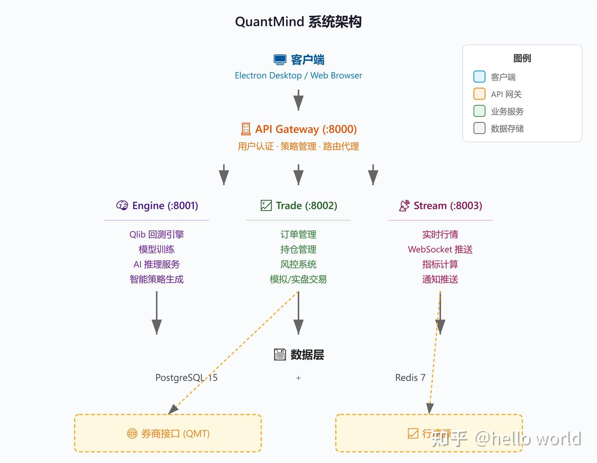

- github (455 stars): https://github.com/qusong0627/quantmind
- 主页：oss.quantmindai.cn/

新一代智能量化交易架构

打通模型训练、回测、推理、实盘全流程闭环

 Qlib 内核驱动
基于微软 Qlib 量化框架深度集成，提供业界领先的量化研究能力：

LightGBM 模型 — 高性能梯度提升模型，专为金融时序预测优化
Alpha158 因子集 — 158 个经典量化因子，覆盖动量、估值、质量等多维度
自动化特征工程 — 51 维标准化特征，开箱即用
🎯 双引擎回测系统
独创 Qlib + Pandas 双引擎架构，灵活应对不同场景：

实盘交易对接
支持多券商实盘交易：

QMT 券商 — 迅投 QMT 深度对接
模拟盘验证 — 实盘前完整模拟
风控系统 — 止损止盈、仓位控制、风险预警

