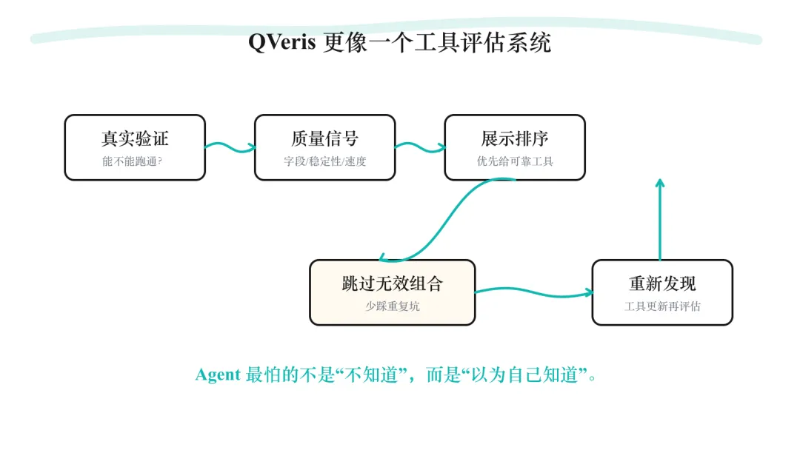
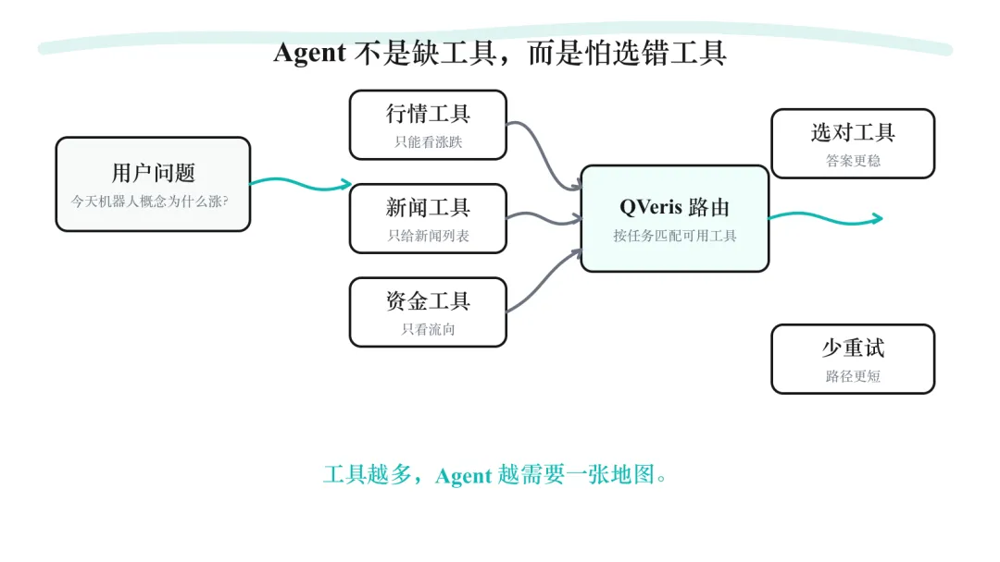

产品矩阵：

QVeris CLI — 终端中的万能 API 入口

QVeris MCP Server — IDE 智能体的工具网关

QVerisBot — 基于 OpenClaw 的生产级 AI 助手

QVeris REST API — 标准 HTTP 接口，适配任何语言和平台

官网：https://qveris.cn

GitHub：https://github.com/QVerisAI/QVerisAI

QVeris 做的，不只是一个金融数据工具集合。 

 更像是在做一层 Agent 的金融数据导航系统。 

 工具多，并不等于 Agent 更聪明。 

 有时候工具越多，Agent 越需要一张地图。 

 这张地图要告诉它： 

 哪些工具可用。 

 哪些工具稳定。 

 哪些工具适合当前任务。 

 哪些结果有真实样例。 

 哪些路径已经被验证不好走。 
 

